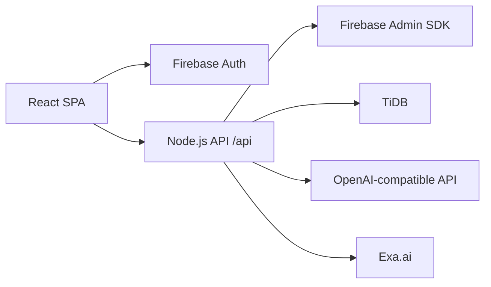

# tt-ni Architecture

tt-ni는 React/Vite 프론트엔드, Node.js API 서버, Firebase Auth, TiDB로 구성됩니다.

## Runtime Responsibilities

| 영역 | 책임 |
| --- | --- |
| React SPA | 화면, 로컬 분석/스케줄 계산, Firebase 로그인, API 호출 |
| Firebase Auth | 이메일/소셜 로그인 및 ID token 발급 |
| Node API | Firebase ID token 검증, TiDB 접근, AI/Search 비밀키 보호 |
| TiDB | 사용자 프로필, 약물, 영양제, 분석 리포트, 채팅 세션 저장 |

브라우저는 TiDB 비밀번호나 AI/Search API 키를 절대 보유하지 않습니다. 모든 민감한 작업은 `server/index.ts`의 `/api/*` 엔드포인트를 통해 처리합니다.
