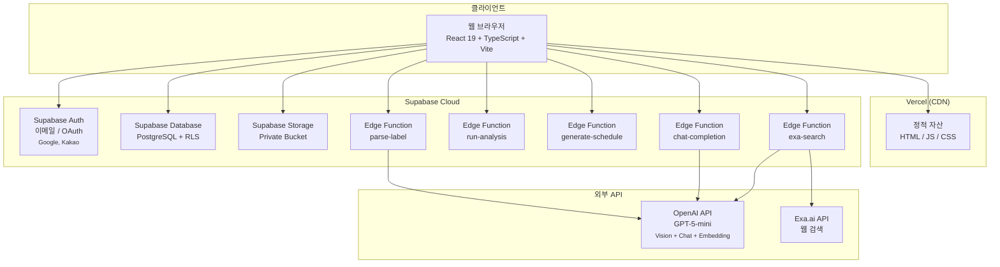
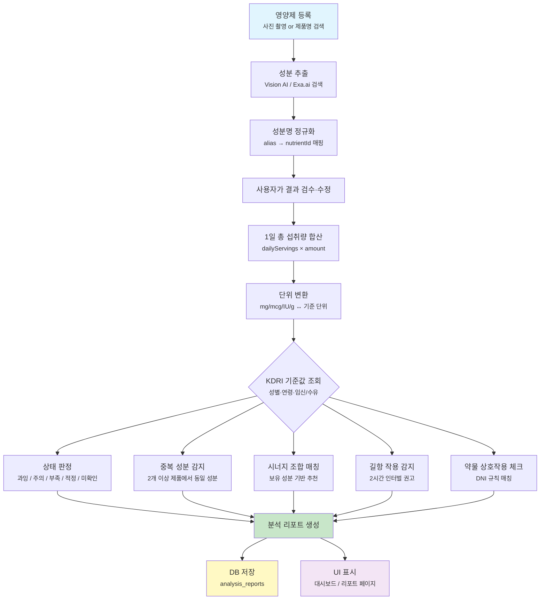
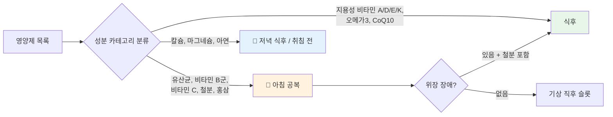

# tt-ni 아키텍처 문서

> 최종 수정일: 2026-05-20

---

## 1. 시스템 아키텍처

tt-ni는 **Vercel**에서 호스팅되는 React SPA 프론트엔드, **Supabase**가 제공하는 백엔드 서비스(BaaS), 그리고 **OpenAI/Exa.ai** 외부 API로 구성됩니다.



### 구성 요소 설명

| 구성 요소 | 역할 |
|-----------|------|
| **React SPA** | 사용자 인터페이스. Supabase JS 클라이언트를 통해 Auth, DB, Storage와 직접 통신. Edge Function은 `supabase.functions.invoke()`로 호출. |
| **Supabase Auth** | 이메일 로그인 + Google/Kakao OAuth. 세션은 `localStorage`에 자동 관리되며, DB 접근 시 JWT가 포함됨. |
| **Supabase Database** | PostgreSQL. 모든 테이블에 RLS(Row Level Security)가 적용되어 `auth.uid()` 기준으로 행 단위 접근 제어. |
| **Supabase Storage** | `labels` 프라이빗 버킷. 업로드된 영양제 라벨 이미지를 저장. 접근은 RLS 정책으로 제어. |
| **Edge Functions** | Supabase Deno 런타임에서 실행되는 서버리스 함수. OpenAI, Exa.ai 등 서드파티 API 호출을 담당하며, secret 키를 안전하게 보관. |
| **Vercel** | `vite build` 결과물을 정적 호스팅. |
| **OpenAI** | Vision API로 이미지 텍스트 인식, Chat API로 분석/검색/채팅, Embeddings API(미구현)로 의미 검색 지원. |
| **Exa.ai** | 제품명 검색 시 웹에서 영양제 성분 정보를 검색하여 구조화된 데이터로 반환. |

---

## 2. 데이터베이스 스키마

총 14개의 테이블로 구성되어 있으며, 모든 테이블에 RLS가 적용되어 있습니다.

```mermaid
erDiagram
    auth_users {
        uuid id PK "Supabase Auth 내장"
    }

    user_profiles {
        uuid id PK
        uuid user_id FK "auth.users.id"
        text gender
        integer birth_year
        integer height_cm
        integer weight_kg
        text pregnancy_status
        boolean lactation_status
        text[] conditions
        text[] allergies
        text[] dietary_restrictions
        boolean consent_accepted
    }

    user_conditions {
        uuid id PK
        uuid user_id FK
        text condition_name
    }

    user_medications {
        uuid id PK
        uuid user_id FK
        text name
        text purpose
        text frequency
        text memo
    }

    nutrients {
        text id PK "예: vitamin_c"
        text standard_name
        text category
        text[] aliases
        text default_unit
        text risk_level
    }

    nutrient_reference_values {
        uuid id PK
        text nutrient_id FK
        text gender
        integer age_min
        integer age_max
        float rda
        float ai
        float ul
        text unit
    }

    interaction_rules {
        uuid id PK
        text nutrient_id FK
        text medication_keyword
        text condition_code
        text severity
        text message
        text source_note
    }

    supplement_products {
        uuid id PK
        text product_name
        text brand_name
        text source_type "manual / photo / search"
        text exa_search_url
        text image_name
    }

    supplement_ingredients {
        uuid id PK
        uuid product_id FK
        uuid parse_job_id FK
        text nutrient_id FK
        text standard_name
        float amount
        text unit
        float confidence
        text raw_text
        boolean review_required
    }

    user_supplements {
        uuid id PK
        uuid user_id FK
        uuid product_id FK
        integer daily_servings
        text intake_time
        boolean active
        boolean confirmed
    }

    label_parse_jobs {
        uuid id PK
        uuid user_id FK
        uuid product_id FK
        text status "pending / processing / completed / failed"
        jsonb result
        text error_message
        timestamptz created_at
    }

    analysis_reports {
        uuid id PK
        uuid user_id FK
        jsonb status_summary
        jsonb totals
        jsonb duplicate_items
        jsonb interaction_warnings
        jsonb recommendations
        jsonb synergy_recommendations
        jsonb antagonism_warnings
        timestamptz created_at
    }

    dosage_schedules {
        uuid id PK
        uuid user_id FK
        date schedule_date
        jsonb slots
        timestamptz created_at
    }

    chat_sessions {
        uuid id PK
        uuid user_id FK
        text title
        timestamptz created_at
    }

    chat_messages {
        uuid id PK
        uuid session_id FK
        text role "user / assistant"
        text content
        timestamptz created_at
    }

    auth_users ||--o{ user_profiles : has
    auth_users ||--o{ user_conditions : has
    auth_users ||--o{ user_medications : has
    auth_users ||--o{ user_supplements : owns
    auth_users ||--o{ label_parse_jobs : submits
    auth_users ||--o{ analysis_reports : generated_for
    auth_users ||--o{ dosage_schedules : scheduled_for
    auth_users ||--o{ chat_sessions : creates

    supplement_products ||--o{ supplement_ingredients : contains
    supplement_products ||--o{ user_supplements : registered_as
    label_parse_jobs ||--o{ supplement_ingredients : produces

    nutrients ||--o{ nutrient_reference_values : references
    nutrients ||--o{ interaction_rules : triggers
    nutrients ||--o{ supplement_ingredients : mapped_to

    chat_sessions ||--o{ chat_messages : contains
```



### 주요 테이블 설명

| 테이블 | 용도 | RLS 정책 |
|--------|------|----------|
| `user_profiles` | 사용자 신체 정보, 건강 상태, 동의 여부 | 본인 행만 R/W |
| `user_medications` | 복용 중인 처방약 정보 | 본인 행만 R/W |
| `nutrients` | 영양소 마스터 (약 50종) | Public R |
| `nutrient_reference_values` | 성별·연령별 KDRI 기준값 | Public R |
| `interaction_rules` | 영양제-약물 상호작용 룰셋 | Public R |
| `supplement_products` | 등록된 영양제 제품 마스터 | 본인 제품만 R/W |
| `supplement_ingredients` | 제품별 성분 상세 | 연관 제품 소유자만 R/W |
| `user_supplements` | 사용자-제품 연결 (복용량, 활성 여부) | 본인 행만 R/W |
| `label_parse_jobs` | 라벨 파싱 작업 상태 추적 | 본인 작업만 R |
| `analysis_reports` | 분석 리포트 결과 (JSONB) | 본인 리포트만 R |
| `dosage_schedules` | 날짜별 복용 스케줄 | 본인 스케줄만 R/W |
| `chat_sessions` / `chat_messages` | AI 채팅 대화 내역 | 본인 대화만 R/W |

---

## 3. 분석 엔진 로직

영양소 분석 파이프라인은 프론트엔드의 `src/features/analysis/analysisEngine.ts`와 Supabase Edge Function `run-analysis`에서 동일한 로직으로 실행됩니다.



### 상태 판정 기준

| 상태 | 조건 | 의미 |
|------|------|------|
| **과잉 (excess)** | `total > UL` | 상한섭취량 초과. 전문가 상담 권고. |
| **주의 (caution)** | `total ≥ 0.8 × UL` | 상한섭취량에 근접. 중복 제품 확인 필요. |
| **적정 (normal)** | `0.7 × RDA ≤ total ≤ 0.8 × UL` | 적정 범위 내. |
| **부족 (deficient)** | `total < 0.7 × RDA` | 등록된 영양제만으로는 기준량 미달. 식사 섭취 함께 확인. |
| **미확인 (review)** | 참조값 없음 | 기준 데이터 부재로 수동 확인 필요. |

### 외삽법 (Extrapolation)

아동 및 노인의 경우 성인 기준값을 체중으로 보정합니다.

- **소아 UL**: `UL_child = UL_adult × (weight_child / 65kg)`
- **노인 EAR**: `EAR_elderly = EAR_adult × (weight_elderly / 65kg)^0.75`

### 시너지 그룹 (대표 예시)

| 조합 | 효능 |
|------|------|
| 비타민 C + 철분 | 비헴철 흡수율 극대화 (Fe³⁺ → Fe²⁺ 환원) |
| CoQ10 + 오메가3 | 혈관 내피세포 건강 + 항산화 네트워크 강화 |
| 비타민 E + 오메가3 | 오메가3 산화 방지, 노화 방지 효능 유지 |
| 비타민 C + 콜라겐 | 콜라겐 합성 필수 조효소, 피부 탄력 개선 |
| 비타민 E + CoQ10 | 이중 항산화 방어벽 (지용성 + 미토콘드리아) |

### 길항 작용 그룹

| 조합 | 인터벌 | 사유 |
|------|--------|------|
| 칼슘 ↔ 철분 | 2시간 | DMT1 수송체 경쟁 |
| 칼슘 ↔ 마그네슘 | 2시간 | 다가 양이온 흡수 경쟁 |
| 칼슘 ↔ 아연 | 2시간 | 다가 양이온 흡수 경쟁 |
| 철분 ↔ 아연 | 2시간 | DMT1 수송체 경쟁 |

---

## 4. 크로노파마콜로지 기반 스케줄링 알고리즘

스케줄링 엔진은 `src/features/schedule/scheduleEngine.ts` 및 Supabase Edge Function `generate-schedule`에 구현되어 있으며, 약물의 복용 시간대별 효과 차이(Chronopharmacology)와 영양소 간 상호작용을 종합적으로 고려합니다.

### 4.1 시간대별 분류



### 4.2 시간대 배치 규칙

| 시간대 | 주요 성분 | 근거 |
|--------|-----------|------|
| **기상 직후 (공복)** | 유산균, 비타민 B군, 비타민 C, 철분, 홍삼, 아미노산 | 흡수율 최적화. 위산 분비가 적은 공복에 유산균 생존율 향상. B군은 에너지 대사와 연계되어 아침 복용이 적합. |
| **아침/점심 식후** | 비타민 A/D/E/K, 오메가3, CoQ10 | 지용성 성분은 식이 지방과 함께 섭취 시 흡수율 증가. |
| **저녁 식후 / 취침 전** | 칼슘, 마그네슘, 아연, 밀크씨슬 | 마그네슘은 수면의 질 개선. 칼슘은 야간 골흡수 억제. 주간 칼슘과 경쟁하는 성분들(철분, 아연)과 시간 분리. |

### 4.3 DNI (Drug-Nutrient Interaction) 충돌 해소 규칙

약물-영양제 상호작용이 감지되면 아래 우선순위로 처리됩니다.

```
1. BLOCK → 해당 영양제를 스케줄에서 완전히 제외하고 경고 표시
   예: 와파린 + 비타민 K, 스타틴 + 자몽추출물

2. WARNING → 같은 시간대 배치를 피하고 인터벌 적용
   예: 항생제 + 유산균 (2시간 간격),
        레보티록신 + 칼슘/철분 (4시간 간격)

3. TIP → 경고 없이 복용 팁만 제공
   예: 메트포르민 + 비타민 B12 (B12 보충 권장),
        스타틴 + CoQ10 (근육 부작용 완화)
```

### 4.4 길항작용 분리 규칙

동일 시간대에 배치된 영양제 중 길항 관계가 발견되면, 다른 슬롯으로 재배치합니다.

```typescript
// 핵심 로직 (scheduleEngine.ts)
if (timeDiffMinutes(timeA, timeB) < rule.hours * 60) {
  // 최소 2시간 이상 떨어진 대체 슬롯 탐색
  const altSlots = slots.filter((s) => {
    if (s.key === currentSlot) return false
    return timeDiffMinutes(s.time, currentTime) >= rule.hours * 60
  })
  if (altSlots.length > 0) {
    resolved.set(conflictingSupplement.id, altSlots[0].key)
  }
}
```

### 4.5 시간대 슬롯 구조

```typescript
interface TimeSlot {
  time: string      // "07:00", "08:30", "13:00", "19:30", "22:00"
  label: string     // "기상 직후", "아침 식후", "점심 식후", "저녁 식후", "취침 전"
  items: string[]   // 해당 슬롯의 영양제 제품명 목록
  tip?: string      // 복용 팁
  warning?: string  // 주의사항
}
```

기상 시간과 식사 시간은 사용자 설정을 반영하며, 기본값은 아래와 같습니다.

```typescript
const DEFAULT_WAKE_TIME = "07:00"
const DEFAULT_MEAL_TIMES = ["08:00", "12:30", "19:00"]

// 슬롯 생성
buildSlots(preferences) // → 기상 직후, 아침 식후 (+30m), 점심 식후 (+30m), 저녁 식후 (+30m), 취침 전 (+3h)
```

---

## 5. API 엔드포인트

모든 Edge Function은 Supabase JS 클라이언트의 `supabase.functions.invoke()`를 통해 호출됩니다.

### 5.1 `parse-label`

| 항목 | 내용 |
|------|------|
| **경로** | `POST /functions/v1/parse-label` |
| **인증** | JWT (Supabase Auth 세션) |
| **입력** | `{ imagePath: string }` — Supabase Storage에 업로드된 이미지 경로 |
| **처리** | Storage에서 이미지 다운로드 → HEIC→JPEG 변환 → OpenAI Vision API로 텍스트 추출 → Structured Output으로 성분 정규화 |
| **출력** | `{ productName, servingSize, dailyServingsRecommended, ingredients[], warnings[] }` |
| **비동기** | `label_parse_jobs` 테이블에 작업 상태 기록 (pending → processing → completed/failed) |

### 5.2 `run-analysis`

| 항목 | 내용 |
|------|------|
| **경로** | `POST /functions/v1/run-analysis` |
| **인증** | JWT |
| **입력** | `{ profile, medications[], supplements[] }` |
| **처리** | 성분 합산 → 단위 변환 → KDRI 기준 비교 → 시너지/길항 판별 → 약물상호작용 체크 |
| **출력** | `{ statusSummary, totals[], duplicateItems[], interactionWarnings[], synergyRecommendations[], antagonismWarnings[], recommendations[] }` |
| **저장** | 결과를 `analysis_reports` 테이블에 저장 |

### 5.3 `exa-search`

| 항목 | 내용 |
|------|------|
| **경로** | `POST /functions/v1/exa-search` |
| **인증** | JWT |
| **입력** | `{ query: string }` — 영양제 제품명 |
| **처리** | Exa.ai API 검색 → 결과 텍스트에서 OpenAI로 성분 추출 |
| **출력** | `{ products: [{ name, brand, ingredients[], sourceUrl }] }` |
| **레이트 리밋** | 사용자당 일일 10회 |

### 5.4 `generate-schedule`

| 항목 | 내용 |
|------|------|
| **경로** | `POST /functions/v1/generate-schedule` |
| **인증** | JWT |
| **입력** | `{ supplements[], medications[], conditions[], preferences: { wakeTime?, mealTimes? } }` |
| **처리** | 시간대 분류 → DNI 충돌 검사 → 길항 작용 분리 → 최종 타임라인 생성 |
| **출력** | `{ slots: TimeSlot[] }` |

### 5.5 `chat-completion`

| 항목 | 내용 |
|------|------|
| **경로** | `POST /functions/v1/chat-completion` |
| **인증** | JWT |
| **입력** | `{ sessionId?, message, context: { profile, supplements[], report? } }` |
| **처리** | System prompt에 사용자 컨텍스트 주입 → OpenAI Chat API 호출 → SSE 스트리밍 응답 → 대화 저장 |
| **출력** | `text/event-stream` (SSE 실시간 스트리밍) |
| **특징** | 20턴 이상 대화 시 자동 요약 → 컨텍스트 압축. 사용자당 일일 50회 제한. |

---

## 6. 보안

### 6.1 Supabase RLS (Row Level Security)

모든 테이블에 RLS가 적용되어 있으며, 핵심 정책은 다음과 같습니다.

```sql
-- 예시: user_profiles 테이블 RLS
ALTER TABLE user_profiles ENABLE ROW LEVEL SECURITY;

CREATE POLICY "사용자는 본인 프로필만 조회 가능"
  ON user_profiles FOR SELECT
  USING (auth.uid() = user_id);

CREATE POLICY "사용자는 본인 프로필만 수정 가능"
  ON user_profiles FOR UPDATE
  USING (auth.uid() = user_id);

CREATE POLICY "사용자는 본인 프로필 생성 가능"
  ON user_profiles FOR INSERT
  WITH CHECK (auth.uid() = user_id);
```

### 6.2 Storage 보안

| 설정 | 값 |
|------|-----|
| **버킷 가시성** | `private` |
| **업로드 정책** | `auth.uid() = (storage.foldername(name))[1]::uuid` |
| **다운로드 정책** | 본인 이미지만 접근 가능 |
| **파일 크기 제한** | 10MB |

### 6.3 JWT 인증 흐름

```
1. 사용자 로그인 → Supabase Auth가 JWT 발급
2. JS 클라이언트가 JWT를 localStorage에 저장
3. 모든 DB/Storage/Function 요청에 JWT 자동 포함
4. Supabase가 JWT 검증 후 RLS 정책에 따라 접근 제어
```

### 6.4 Service Role Key 관리

| 키 | 보관 위치 | 접근 주체 |
|----|-----------|-----------|
| `VITE_SUPABASE_PUBLISHABLE_KEY` | `.env.local` (브라우저 노출 허용) | 프론트엔드 |
| `SUPABASE_SERVICE_ROLE_KEY` | Supabase Vault Secret | Edge Functions (내부 관리 작업) |
| `OPENAI_API_KEY` | Supabase Vault Secret | Edge Functions (`parse-label`, `chat-completion`, `run-analysis`) |
| `EXA_API_KEY` | Supabase Vault Secret | Edge Functions (`exa-search`) |
| `TT_NI_SERVICE_ROLE_KEY` | Supabase Vault Secret | Edge Functions (크로스 펑션 인증) |

```bash
# Edge Function secret 설정 명령어
supabase secrets set OPENAI_API_KEY=sk-...
supabase secrets set EXA_API_KEY=...
supabase secrets set TT_NI_SERVICE_ROLE_KEY=...
```

> 서버 전용 키가 브라우저 번들에 포함되지 않도록, `VITE_` 접두사가 없는 환경 변수는 Vite에서 노출되지 않습니다.

---

## 7. 모델 설정

모든 AI 모델 관련 설정은 Supabase Edge Function secret으로 관리되며, `src/features/nutrition/nutritionData.ts`에는 포함되지 않습니다.

| 환경 변수 | 기본값 | 용도 |
|-----------|--------|------|
| `OPENAI_CHAT_MODEL` | `gpt-5-mini` | AI 채팅, 분석, 검색 결과 파싱 |
| `OPENAI_VISION_MODEL` | `gpt-5-mini` | 영양제 라벨 이미지 텍스트 인식 |
| `OPENAI_MODEL` | `gpt-5-mini` | 하위 호환 (위 두 변수가 없을 때 fallback) |
| `OPENAI_EMBEDDING_MODEL` | `text-embedding-3-small` | 의미 검색용 임베딩 (현재 미구현) |

Embedding 기능은 아직 구현되지 않았으며, 호출 시 아래와 같은 예외 처리가 적용됩니다.

```typescript
// supabase/functions/chat-completion/index.ts
if (model === 'text-embedding-3-small') {
  throw new Error('Embedding is not implemented yet')
}
```
