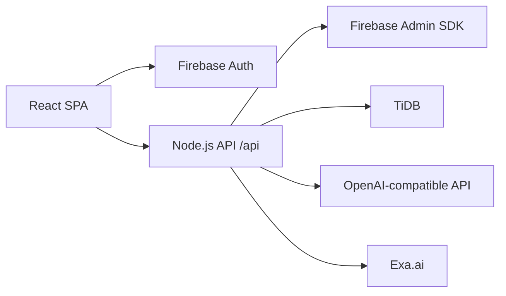

# tt-ni Architecture

tt-ni는 React/Vite 프론트엔드, Node.js API 서버, Firebase Auth, TiDB로 구성됩니다.

## 인증 흐름 (Authentication Flow)

1. **클라이언트 로그인**: `src/lib/firebase.ts`에서 Firebase Auth(Google, Kakao, Email)로 로그인
2. **ID Token 획득**: 로그인 성공 시 Firebase가 발급한 ID token을 `src/lib/apiClient.ts`에서 `Authorization: Bearer <token>` 헤더로 모든 API 요청에 포함
3. **서버 검증**: `server/index.ts`의 `authenticate` 미들웨어가 Firebase Admin SDK로 토큰을 검증하고 `req.user`에 사용자 정보(uid, email)를 주입
4. **사용자 동기화**: `ensureUser()`가 `app_users` 테이블에 upsert 하여 Firebase UID와 DB UID를 연결

## 실행 환경별 책임 (Runtime Responsibilities)

| 영역 | 책임 |
| --- | --- |
| React SPA | 화면, 로컬 분석/스케줄 계산, Firebase 로그인, API 호출 |
| Firebase Auth | 이메일/소셜 로그인 및 ID token 발급 |
| Node API | Firebase ID token 검증, TiDB 접근, AI/Search 비밀키 보호 |
| TiDB | 사용자 프로필, 약물, 영양제, 분석 리포트, 채팅 세션 저장 |

## 데이터 흐름 (Data Flow)

### 영양제 등록 워크플로우
1. 사용자가 이미지 업로드/검색/수동입력으로 성분 정보 생성
2. `refine-ingredients` API를 통해 표준 영양소명 매칭 (서버 메모리 내 `nutritionData.ts` 기준)
3. 검수 완료된 성분을 `saveSupplementProduct()`로 저장 → `supplement_products` + `supplement_ingredients` + `user_supplements` 트랜잭션 삽입

### 분석 워크플로우
1. `runAnalysis()` (클라이언트) 또는 서버 `/api/analysis` 호출로 분석 실행
2. `analysisEngine.ts`가 영양소별 1일 총 섭취량을 KDRIs 기준치와 비교
3. 약물-영양소 상호작용(DNI) 규칙(`interactionRules`) 검사
4. 시너지/길항작용 분석 및 권장사항 생성
5. 분석 리포트를 `app_analysis_reports` 테이블에 JSON 형식으로 저장

### AI 채팅 워크플로우
1. SSE(Server-Sent Events) 스트리밍 방식으로 AI 응답 전송
2. 대화 컨텍스트에 사용자 프로필, 건강 상태, 영양제, 분석 결과 포함
3. 채팅 세션(`app_chat_sessions`)과 메시지(`app_chat_messages`)가 DB에 저장됨

## API 엔드포인트

모든 `/api/*` 엔드포인트는 `authenticate` 미들웨어를 통과하며(단 `/api/health` 제외), `asyncRoute` 래퍼로 감싸져 오류 처리가 됩니다.

| Method | Path | 설명 |
|--------|------|------|
| GET | `/api/health` | 서버 상태 확인 (인증 불필요) |
| GET | `/api/user-data` | 사용자 프로필, 약물, 영양제, 최신 분석 리포트 일괄 조회 |
| POST | `/api/profile` | 프로필/건강상태/약물 저장 (트랜잭션) |
| POST | `/api/supplements` | 영양제 제품 + 성분 + 사용자 연결 저장 (트랜잭션) |
| PATCH | `/api/supplements/:id` | 제품명/브랜드/복용횟수/복용시간 수정 |
| POST | `/api/supplements/ingredients` | 영양제 성분 정보 배치 업데이트 |
| DELETE | `/api/supplements/:id` | 영양제 제품 삭제 (CASCADE) |
| POST | `/api/analysis` | 분석 리포트 저장 (클라이언트 분석 결과를 DB에 저장) |
| POST | `/api/generate-schedule` | 복용 스케줄 생성 (서버 측 계산) |
| POST | `/api/refine-ingredients` | 성분명 정제 (표준명 매칭 + 기본 효능 정보 부여) |
| POST | `/api/parse-label` | 이미지 업로드 → Vision AI 성분표 파싱 (multipart/form-data) |
| POST | `/api/exa-search` | Exa.ai 제품명 검색 → 성분 정보 추출 |
| GET | `/api/chat/sessions` | 채팅 세션 목록 조회 |
| POST | `/api/chat/sessions` | 새 채팅 세션 생성 |
| PATCH | `/api/chat/sessions/:id` | 채팅 세션 제목 수정 |
| GET | `/api/chat/sessions/:id/messages` | 세션별 메시지 내역 조회 |
| POST | `/api/chat/completion` | AI 채팅 응답 (SSE 스트리밍) |

## 보안

브라우저는 TiDB 비밀번호나 AI/Search API 키를 절대 보유하지 않습니다. 모든 민감한 작업은 `server/index.ts`의 `/api/*` 엔드포인트를 통해 처리합니다. Firebase ID token은 서버 측에서 `verifyIdToken()`으로 검증되어 위조·만료를 방지합니다.
